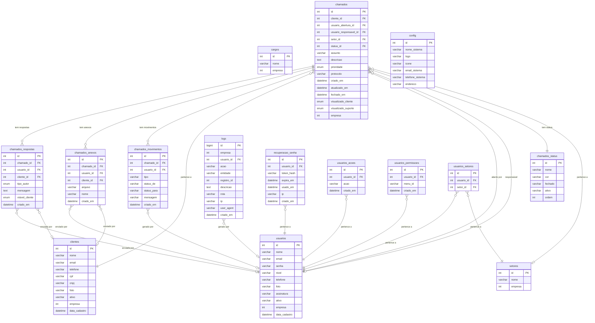
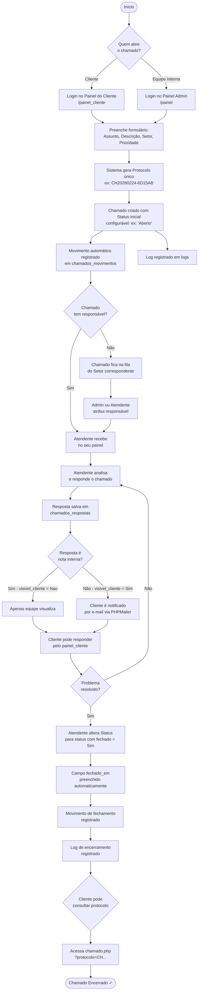

# Documentação Técnica — Sistema HelpDesk

> **Versão do documento:** 1.0  
> **Data de geração:** Maio de 2026  
> **Finalidade:** Alimentar o NotebookLM para geração de apresentação técnica completa

---

## 1. Resumo Executivo

### Propósito do Sistema

O **HelpDesk** é um sistema web de gerenciamento de chamados de suporte técnico desenvolvido em PHP com banco de dados MySQL. Seu objetivo é centralizar, organizar e rastrear todas as solicitações de suporte abertas por clientes, garantindo que cada demanda seja atendida, acompanhada e encerrada de forma controlada e documentada.

### Problema que Resolve

Empresas que prestam suporte técnico ou atendimento ao cliente frequentemente lidam com demandas chegando por e-mail, WhatsApp, telefone e outros canais descentralizados, tornando impossível rastrear o histórico de atendimentos, medir o tempo de resolução e garantir que nenhuma solicitação seja perdida.

O HelpDesk resolve esse problema ao oferecer:

- Um **canal único** de abertura de chamados, acessível tanto pela equipe interna quanto pelos clientes finais
- **Protocolo único** gerado automaticamente para cada chamado (`CH20260224-XXXXXX`), permitindo rastreamento preciso
- **Painel administrativo** completo para a equipe de suporte gerenciar, responder e encerrar chamados
- **Painel do cliente** autônomo, onde o próprio cliente abre e acompanha seus chamados
- **Auditoria total** de todas as ações realizadas no sistema através de logs detalhados

---

## 2. Arquitetura do Sistema

### Stack Tecnológica

| Camada | Tecnologia |
|---|---|
| Linguagem Back-end | PHP 8.x |
| Banco de Dados | MySQL (InnoDB / utf8mb4) |
| Front-end | HTML5, CSS3, JavaScript (jQuery) |
| Framework CSS | Bootstrap 5 + Bootstrap Icons |
| Tabelas Interativas | DataTables 1.13 |
| Geração de PDF | DomPDF (relatórios internos) |
| Exportação Excel | SimpleXLSX / Buttons HTML5 (DataTables) |
| E-mail | PHPMailer (SMTP) |
| Gráficos | Chart.js |

### Padrão de Projeto

O sistema segue uma arquitetura baseada em **MVC Simplificado** com separação clara de responsabilidades:

```
helpdesk/
├── conexao.php                  → Configuração PDO (Model - conexão)
├── autenticar.php               → Lógica de autenticação
├── chamado.php                  → Consulta pública de protocolo
├── painel/                      → Painel administrativo (equipe)
│   ├── index.php                → Controller principal (roteamento)
│   ├── verificar.php            → Middleware de sessão/autenticação
│   ├── paginas/                 → Views por módulo
│   │   ├── dashboard.php
│   │   ├── abertura.php
│   │   ├── clientes.php
│   │   ├── usuarios.php
│   │   ├── setores.php
│   │   ├── cargos.php
│   │   ├── status_abertura.php
│   │   ├── logs.php
│   │   └── backup.php
│   ├── ajax/                    → Endpoints JSON (Controller AJAX)
│   │   └── abertura/
│   │       ├── salvar.php
│   │       ├── listar.php
│   │       ├── respostas_salvar.php
│   │       ├── anexos_salvar.php
│   │       └── ...
│   ├── relatorios/              → Geração de PDF via DomPDF
│   │   ├── abertura.php
│   │   ├── clientes.php
│   │   └── logs.php
│   ├── includes/                → Helpers globais
│   │   ├── permissoes.php
│   │   └── logs.php
│   └── config/
│       └── menu.php             → Definição dinâmica do menu
├── painel_cliente/              → Painel autônomo do cliente
│   ├── paginas/
│   ├── ajax/
│   └── includes/
├── uploads/                     → Arquivos enviados (anexos, fotos, assinaturas)
│   ├── arquivos/
│   ├── perfil/
│   ├── clientes/
│   └── assinaturas/
└── libs/                        → Bibliotecas de terceiros
    ├── simplexlsx-master/
    └── dompdf/
```

### Dois Painéis Independentes

O sistema possui **dois painéis completamente separados**:

**Painel Administrativo (`/painel`):** Acesso exclusivo para a equipe interna (Administradores e Atendentes). Permite gerenciamento completo de chamados, clientes, usuários, relatórios e configurações.

**Painel do Cliente (`/painel_cliente`):** Acesso exclusivo para clientes cadastrados. Permite apenas abrir chamados, visualizar os próprios chamados e responder às interações da equipe.

---

## 3. Representação do Banco de Dados

### Diagrama Entidade-Relacionamento (Mermaid)



### Mapa de Relacionamentos

| Tabela A | Tipo | Tabela B | Descrição |
|---|---|---|---|
| `chamados` | N:1 | `clientes` | Chamado pertence a um cliente |
| `chamados` | N:1 | `usuarios` | Chamado tem um responsável (usuário) |
| `chamados` | N:1 | `chamados_status` | Chamado tem um status |
| `chamados` | N:1 | `setores` | Chamado é direcionado a um setor |
| `chamados` | 1:N | `chamados_respostas` | Chamado possui múltiplas respostas |
| `chamados` | 1:N | `chamados_anexos` | Chamado possui múltiplos anexos |
| `chamados` | 1:N | `chamados_movimentos` | Chamado possui histórico de movimentos |
| `usuarios` | N:N | `setores` | Usuário pode atender múltiplos setores (via `usuarios_setores`) |
| `usuarios` | 1:N | `usuarios_acoes` | Usuário tem permissões CRUD específicas |
| `usuarios` | 1:N | `usuarios_permissoes` | Usuário tem acesso a menus específicos |
| `usuarios` | 1:N | `recuperacao_senha` | Usuário pode ter múltiplos tokens de recuperação |
| `usuarios` | 1:N | `logs` | Todas ações do usuário são registradas |

---

## 4. Dicionário de Dados

### `chamados` — Tabela Central do Sistema

Armazena todos os chamados de suporte abertos. É o coração do sistema.

| Coluna | Tipo | Descrição |
|---|---|---|
| `id` | INT PK | Identificador único auto-incremento |
| `cliente_id` | INT FK | Cliente solicitante (referência a `clientes`) |
| `usuario_abertura_id` | INT FK | Usuário interno que registrou o chamado |
| `usuario_responsavel_id` | INT FK NULLABLE | Atendente responsável pelo chamado |
| `setor_id` | INT FK NULLABLE | Setor ao qual o chamado foi direcionado |
| `status_id` | INT FK | Status atual do chamado |
| `assunto` | VARCHAR(120) | Título/assunto do chamado |
| `descricao` | TEXT | Descrição detalhada da solicitação |
| `prioridade` | ENUM | `Baixa`, `Media`, `Alta`, `Urgente` |
| `protocolo` | VARCHAR(30) | Código único gerado automaticamente (ex: `CH20260224-6D15AB`) |
| `visualizado_cliente` | ENUM | Indica se o cliente visualizou a última atualização |
| `visualizado_suporte` | ENUM | Indica se o suporte visualizou a última atualização |
| `criado_em` | DATETIME | Data e hora de criação |
| `atualizado_em` | DATETIME | Data da última atualização |
| `fechado_em` | DATETIME | Data de encerramento (quando aplicável) |
| `empresa` | INT | Identificador de empresa (preparado para modelo multi-tenant) |

---

### `usuarios` — Equipe Interna

Armazena os usuários do painel administrativo: Administradores e Atendentes.

| Coluna | Tipo | Descrição |
|---|---|---|
| `id` | INT PK | Identificador único |
| `nome` | VARCHAR(100) | Nome completo |
| `email` | VARCHAR(100) | E-mail de login |
| `senha` | VARCHAR(255) | Hash bcrypt da senha |
| `nivel` | VARCHAR(50) | `Administrador`, `Atendente` ou `Comum` |
| `telefone` | VARCHAR(20) | Telefone de contato |
| `foto` | VARCHAR(255) | Nome do arquivo de foto de perfil |
| `assinatura` | VARCHAR(100) | Nome do arquivo de assinatura (usada nos relatórios PDF) |
| `ativo` | VARCHAR(5) | `Sim` ou `Não` |
| `empresa` | INT | Empresa à qual pertence |
| `cpf`, `endereco`, `cidade`, `estado`, `cep` | VARCHAR | Dados cadastrais complementares |
| `data_cadastro` | DATETIME | Data de criação do registro |

---

### `clientes` — Clientes / Solicitantes

Armazena os clientes que abrem chamados. Possuem acesso autônomo ao painel do cliente.

| Coluna | Tipo | Descrição |
|---|---|---|
| `id` | INT PK | Identificador único |
| `nome` | VARCHAR | Nome ou razão social |
| `email` | VARCHAR | E-mail de login no painel do cliente |
| `senha` | VARCHAR | Hash bcrypt |
| `telefone` | VARCHAR | Telefone |
| `cpf` / `cnpj` | VARCHAR | Documentos fiscais |
| `foto` | VARCHAR | Foto de perfil |
| `ativo` | VARCHAR | Status de ativação |
| `empresa` | INT | Empresa vinculada |
| `data_cadastro` | DATETIME | Data de cadastro |

---

### `setores` — Departamentos de Atendimento

Define os departamentos disponíveis para direcionamento dos chamados.

| Coluna | Tipo | Descrição |
|---|---|---|
| `id` | INT PK | Identificador |
| `nome` | VARCHAR(100) | Nome do setor (ex: Suporte Técnico, Financeiro, TI) |
| `empresa` | INT | Empresa vinculada |

*Exemplos de setores cadastrados: Suporte Técnico, Financeiro, Comercial, RH, TI, Atendimento ao Cliente, Infraestrutura, Administrativo.*

---

### `chamados_status` — Status Configuráveis

Permite que o administrador defina os status do fluxo de atendimento, com cores visuais.

| Coluna | Tipo | Descrição |
|---|---|---|
| `id` | INT PK | Identificador |
| `nome` | VARCHAR | Nome do status (ex: Aberto, Em Análise, Em Atendimento) |
| `cor` | VARCHAR | Cor hexadecimal para exibição visual (ex: `#28a745`) |
| `fechado` | ENUM | `Sim` / `Não` — indica se é um status de encerramento |
| `ativo` | ENUM | `Sim` / `Não` — se aparece nas opções |
| `ordem` | INT | Ordem de exibição |

---

### `chamados_respostas` — Conversação do Chamado

Registra todas as mensagens trocadas dentro de um chamado, seja da equipe, do cliente ou do sistema.

| Coluna | Tipo | Descrição |
|---|---|---|
| `id` | INT PK | Identificador |
| `chamado_id` | INT FK | Chamado ao qual pertence |
| `usuario_id` | INT FK NULLABLE | Usuário autor (se for da equipe) |
| `cliente_id` | INT FK NULLABLE | Cliente autor (se for do cliente) |
| `tipo_autor` | ENUM | `usuario`, `cliente`, `sistema` |
| `mensagem` | TEXT | Conteúdo da resposta |
| `visivel_cliente` | ENUM | `Sim` / `Nao` — controla notas internas |
| `criado_em` | DATETIME | Data da resposta |

---

### `chamados_movimentos` — Histórico de Eventos

Registra automaticamente cada alteração importante no chamado: mudança de status, troca de responsável, alteração de setor, etc.

| Coluna | Tipo | Descrição |
|---|---|---|
| `id` | INT PK | Identificador |
| `chamado_id` | INT FK | Chamado relacionado |
| `usuario_id` | INT FK | Quem realizou a ação |
| `tipo` | VARCHAR | Tipo de evento: `status`, `sistema`, `resposta` |
| `status_de` | VARCHAR | Status anterior (quando aplicável) |
| `status_para` | VARCHAR | Status novo (quando aplicável) |
| `mensagem` | VARCHAR | Descrição do evento gerado automaticamente |
| `criado_em` | DATETIME | Timestamp do evento |

---

### `chamados_anexos` — Arquivos Anexados

Armazena os arquivos enviados junto a um chamado ou resposta.

| Coluna | Tipo | Descrição |
|---|---|---|
| `id` | INT PK | Identificador |
| `chamado_id` | INT FK | Chamado vinculado |
| `usuario_id` | INT FK NULLABLE | Quem enviou (usuário interno) |
| `cliente_id` | INT FK NULLABLE | Quem enviou (cliente) |
| `arquivo` | VARCHAR(255) | Nome do arquivo físico salvo em `/uploads/arquivos/` |
| `nome` | VARCHAR(255) | Nome original do arquivo |
| `criado_em` | DATETIME | Data do upload |

*Tipos permitidos: PDF, DOC, DOCX, XLS, XLSX, CSV, TXT, PNG, JPG, JPEG, WEBP, GIF, ZIP, RAR. Limite: 12MB por arquivo.*

---

### `logs` — Auditoria Completa

Registra absolutamente todas as ações realizadas no sistema: login, logout, inserção, edição e exclusão de qualquer entidade.

| Coluna | Tipo | Descrição |
|---|---|---|
| `id` | BIGINT PK | Identificador (suporta alto volume) |
| `empresa` | INT | Empresa do contexto |
| `usuario_id` | INT FK | Usuário que realizou a ação |
| `acao` | VARCHAR | `login`, `logout`, `inserir`, `editar`, `excluir` |
| `entidade` | VARCHAR | Tabela afetada (ex: `chamados`, `clientes`) |
| `registro_id` | INT | ID do registro afetado |
| `descricao` | TEXT | Descrição legível da ação |
| `rota` | VARCHAR | URL do endpoint chamado |
| `ip` | VARCHAR(45) | Endereço IP do usuário |
| `user_agent` | VARCHAR | Navegador/dispositivo utilizado |
| `criado_em` | DATETIME | Timestamp da ação |

---

### `recuperacao_senha` — Tokens de Recuperação

Gerencia os tokens de redefinição de senha com expiração automática.

| Coluna | Tipo | Descrição |
|---|---|---|
| `id` | INT PK | Identificador |
| `usuario_id` | INT FK | Usuário solicitante (CASCADE DELETE) |
| `token_hash` | VARCHAR(255) | Hash bcrypt do token enviado por e-mail |
| `expira_em` | DATETIME | Prazo de validade do token |
| `usado_em` | DATETIME NULLABLE | Preenchido quando o token é consumido |
| `ip` | VARCHAR(45) | IP da solicitação |
| `criado_em` | DATETIME | Data da geração |

---

### `usuarios_acoes` — Permissões CRUD

Define quais operações CRUD cada usuário não-administrador pode realizar.

| Coluna | Tipo | Descrição |
|---|---|---|
| `id` | INT PK | Identificador |
| `usuario_id` | INT FK | Usuário |
| `acao` | VARCHAR(30) | `criar`, `editar`, `excluir` |
| `criado_em` | TIMESTAMP | Data de concessão |

*Administradores têm acesso total automaticamente, sem precisar de registros aqui.*

---

### `usuarios_permissoes` — Acesso a Módulos do Menu

Controla quais seções do painel cada usuário pode visualizar.

| Coluna | Tipo | Descrição |
|---|---|---|
| `id` | INT PK | Identificador |
| `usuario_id` | INT FK | Usuário |
| `menu_id` | VARCHAR(50) | Identificador do módulo: `dashboard`, `abertura`, `clientes`, `usuarios`, `logs`, `backup` |
| `criado_em` | TIMESTAMP | Data de concessão |

---

### `usuarios_setores` — Atendente por Setor (N:N)

Tabela de junção que define em quais setores cada atendente pode ver e receber chamados.

| Coluna | Tipo | Descrição |
|---|---|---|
| `id` | INT PK | Identificador |
| `usuario_id` | INT FK | Atendente |
| `setor_id` | INT FK | Setor permitido |

---

### `cargos` — Cargos Cadastrais

Tabela auxiliar para categorização de funções. Utilizada no cadastro de usuários.

| Coluna | Tipo | Descrição |
|---|---|---|
| `id` | INT PK | Identificador |
| `nome` | VARCHAR(75) | Nome do cargo |
| `empresa` | INT | Empresa vinculada |

---

### `config` — Configurações do Sistema

Armazena as configurações globais da instalação: identidade visual e dados de contato.

| Coluna | Tipo | Descrição |
|---|---|---|
| `id` | INT PK | Identificador |
| `nome_sistema` | VARCHAR | Nome exibido no painel |
| `logo` | VARCHAR | Arquivo de logotipo |
| `icone` | VARCHAR | Arquivo de ícone (favicon) |
| `email_sistema` | VARCHAR | E-mail de contato |
| `telefone_sistema` | VARCHAR | Telefone de contato |
| `endereco` | VARCHAR | Endereço da empresa |

---

## 5. Fluxo do Usuário

### Fluxo Completo: Do Nascimento ao Encerramento do Chamado



### Resumo das Etapas

**1. Abertura:** O cliente (pelo painel do cliente) ou a equipe (pelo painel admin) preenche assunto, descrição, setor e prioridade. O sistema gera automaticamente um protocolo único com o padrão `CH + data + hash hexadecimal`.

**2. Triagem:** O chamado entra com o primeiro status ativo cadastrado. Se não tiver responsável atribuído, fica visível para todos os atendentes do setor correspondente.

**3. Atribuição:** O Administrador ou o próprio Atendente assume o chamado. A troca de responsável gera um movimento automático no histórico.

**4. Atendimento:** O atendente responde através do painel. Pode enviar respostas visíveis ao cliente ou notas internas (ocultas). Cada resposta aciona notificação por e-mail via PHPMailer.

**5. Acompanhamento:** O cliente pode acompanhar o chamado pelo painel do cliente ou consultar o protocolo publicamente em `chamado.php?protocolo=CHXXXXXXXX`.

**6. Encerramento:** O atendente move o chamado para um status marcado como `fechado = Sim`. O sistema preenche automaticamente o campo `fechado_em` e registra o evento no histórico e nos logs.

---

## 6. Destaques Técnicos

### 6.1 Sistema de Níveis de Acesso

O sistema possui **três níveis de usuário interno** mais o **acesso de cliente**:

| Nível | Acesso |
|---|---|
| **Administrador** | Acesso total a todos os módulos, sem restrições. CRUD completo automático. |
| **Atendente** | Acesso configurável por módulo e por ação (criar, editar, excluir). Visibilidade de chamados limitada aos seus setores. |
| **Comum** | Acesso mínimo, controlado individualmente por menu e por ação. |
| **Cliente** | Acesso exclusivo ao painel do cliente. Vê apenas seus próprios chamados. |

A lógica de controle é implementada via duas funções centrais em `permissoes.php`:

- `podeFazer(string $acao)` — verifica se o usuário pode executar `criar`, `editar` ou `excluir`
- `podeAcessar(?array $perms, string $menuId)` — verifica se o usuário pode ver determinado módulo do menu

### 6.2 Segurança

- **Senhas com bcrypt:** Todas as senhas são armazenadas como hash bcrypt via `password_hash()`, nunca em texto puro.
- **CSRF Protection:** Token CSRF de uso único implementado no formulário de login (`csrf_token_login`).
- **Validação de sessão:** Cada página do painel verifica a sessão com `verificar.php`, incluindo comparação de token anti-hijack (`$_SESSION['token_login'] == $_SESSION['id']`).
- **Prepared Statements (PDO):** Todas as queries ao banco utilizam PDO com prepared statements e parâmetros nomeados, prevenindo SQL Injection.
- **Sanitização de output:** Todas as saídas HTML passam pela função `esc()` que aplica `htmlspecialchars()`, prevenindo XSS.
- **Upload seguro:** Os arquivos enviados passam por validação de extensão, tamanho máximo (12MB), verificação de `is_uploaded_file()`, e são renomeados com token aleatório (`bin2hex(random_bytes(8))`), eliminando path traversal.
- **Recuperação de senha com token:** Tokens gerados com hash bcrypt, com prazo de expiração definido, IP registrado e marcados como usados após consumo.

### 6.3 Visibilidade de Chamados por Setor

Atendentes com nível diferente de Administrador só visualizam chamados nos quais:

1. São o responsável designado (`usuario_responsavel_id = usuário logado`), **ou**
2. O chamado pertence a um dos setores vinculados ao atendente na tabela `usuarios_setores` e ainda não tem responsável

Isso garante que nenhum atendente veja chamados de setores que não são de sua competência.

### 6.4 Geração de Relatórios em PDF

O sistema possui geração de relatórios PDF internos através da biblioteca **DomPDF**, com:

- Cabeçalho com logotipo da empresa (convertido para base64 data URI)
- Filtros aplicados exibidos no relatório (período, status, prioridade, cliente, responsável)
- Assinatura digital do usuário que gerou o relatório
- Tabela de chamados com status colorido, prioridade e demais informações
- Suporte a orientação retrato e paisagem

**Relatórios disponíveis:**
- Relatório de Abertura de Chamados (com filtros avançados)
- Relatório de Clientes
- Relatório de Logs de Auditoria

### 6.5 Exportação e Importação de Dados

- **Exportar clientes para Excel (.xlsx):** Através da biblioteca SimpleXLSX e DataTables Buttons HTML5
- **Importar clientes via planilha XLS/XLSX:** Upload de arquivo e processamento servidor
- **Backup completo do banco de dados:** Gerado em SQL diretamente pelo sistema, sem dependência de ferramentas externas, salvo em `painel/backups/`

### 6.6 Dashboard com Indicadores em Tempo Real

O dashboard exibe métricas calculadas dinamicamente:

- Total de chamados abertos, em atendimento, concluídos e sem responsável
- Total de clientes ativos
- Chamados abertos no mês atual
- **Gráfico de pizza/doughnut** (Chart.js) com distribuição de chamados por status, com as cores configuradas dinamicamente para cada status
- Listagem dos últimos chamados com indicador visual da última resposta (cliente ou suporte)

### 6.7 Notificações por E-mail

O sistema utiliza **PHPMailer** para notificações automáticas via SMTP, disparando e-mails nos eventos:

- Novo chamado aberto
- Nova resposta adicionada ao chamado
- Mudança de status do chamado
- Solicitação de recuperação de senha

### 6.8 Consulta Pública de Protocolo

A página `chamado.php?protocolo=CHXXXXXXXX` permite que qualquer pessoa consulte o status de um chamado informando apenas o protocolo, sem necessidade de login. Isso facilita o acompanhamento por parte de clientes que não possuem acesso ao painel.

### 6.9 Histórico de Movimentos Automáticos

Cada evento importante no ciclo de vida de um chamado gera automaticamente um registro em `chamados_movimentos`, criando uma timeline auditável:

- Abertura do chamado com status inicial
- Alteração de status (de/para)
- Troca de responsável
- Alteração de setor
- Alteração de assunto
- Alteração de cliente

### 6.10 Preparação para Multi-Tenant (SaaS)

O banco de dados possui o campo `empresa` em todas as tabelas principais. Embora o sistema esteja rodando atualmente em modo single-tenant (`empresa = 0`), a estrutura está preparada para evolução para um modelo SaaS com múltiplas empresas na mesma instalação.

---

## Glossário Rápido

| Termo | Definição |
|---|---|
| **Chamado** | Solicitação de suporte ou atendimento registrada no sistema |
| **Protocolo** | Código único gerado para identificar um chamado (ex: `CH20260224-6D15AB`) |
| **Atendente** | Usuário interno responsável por responder e resolver chamados |
| **Status** | Fase atual do chamado no fluxo de atendimento (configurável pelo admin) |
| **Prioridade** | Urgência do chamado: Baixa, Média, Alta ou Urgente |
| **Setor** | Departamento responsável pelo atendimento (ex: TI, Financeiro) |
| **Nota Interna** | Resposta visível apenas para a equipe interna, oculta do cliente |
| **Movimento** | Evento automático registrado a cada alteração relevante no chamado |
| **Log** | Registro de auditoria de toda ação realizada por qualquer usuário |
| **Multi-tenant** | Arquitetura que permite múltiplas empresas na mesma instalação do sistema |

---

*Documento gerado automaticamente com base no código-fonte e banco de dados do projeto HelpDesk.*
